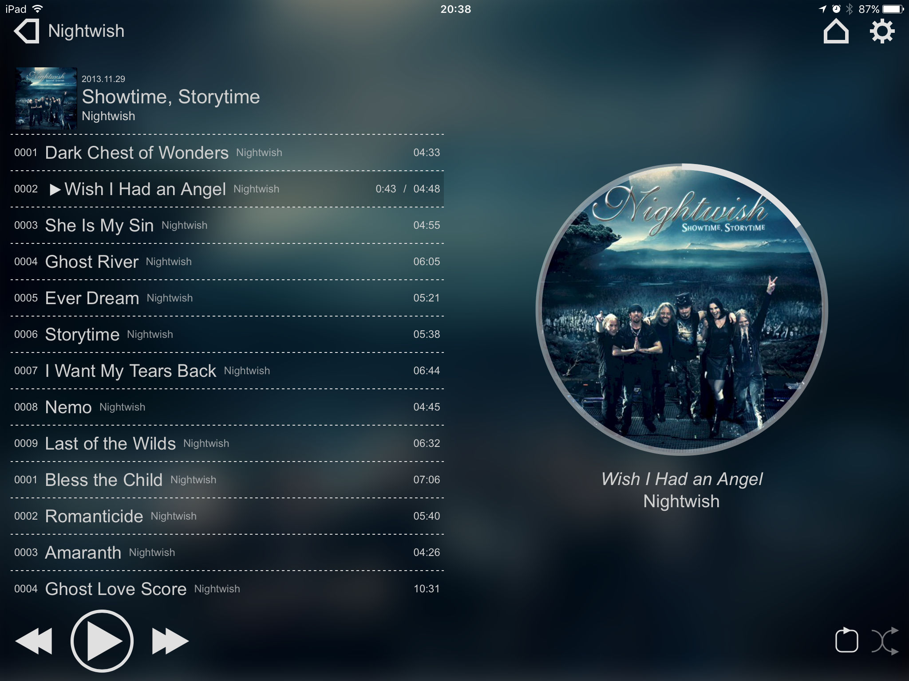

==
vv
==

.. image:: https://github.com/meiraka/vv/workflows/test/badge.svg
   :target: https://github.com/meiraka/vv/actions

Web App client for Music Player Daemon

Installation
============

.. code-block:: shell

  go get github.com/meiraka/vv

Or get pre-built binary from `GitHub Releases page <https://github.com/meiraka/vv/releases>`_ and extract to somewhere you want.

Options
=======

.. code-block:: shell

  -d, --debug                        use local assets if exists
      --mpd.addr string              mpd server address to connect
      --mpd.binarylimit string       set the maximum binary response size of mpd
      --mpd.conf string              set mpd.conf path to get music_directory and http audio output
      --mpd.music_directory string   set music_directory in mpd.conf value to search album cover image
      --mpd.network string           mpd server network to connect
      --server.addr string           this app serving address
      --server.cover.remote          enable coverart via mpd api

Configuration
=============

put `config.yaml <./appendix/example.config.yaml>`_ to /etc/xdg/vv/ or ~/.config/vv/
